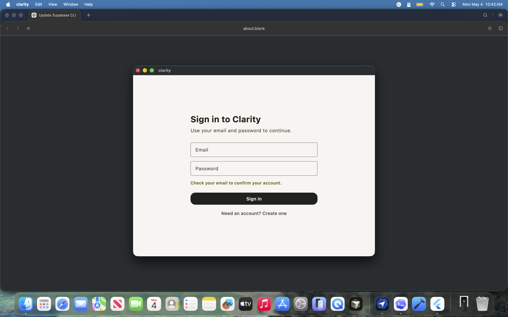
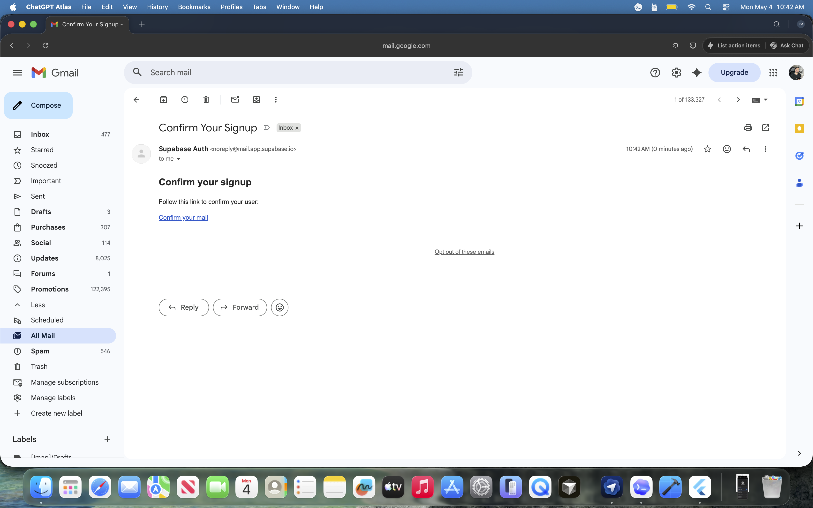
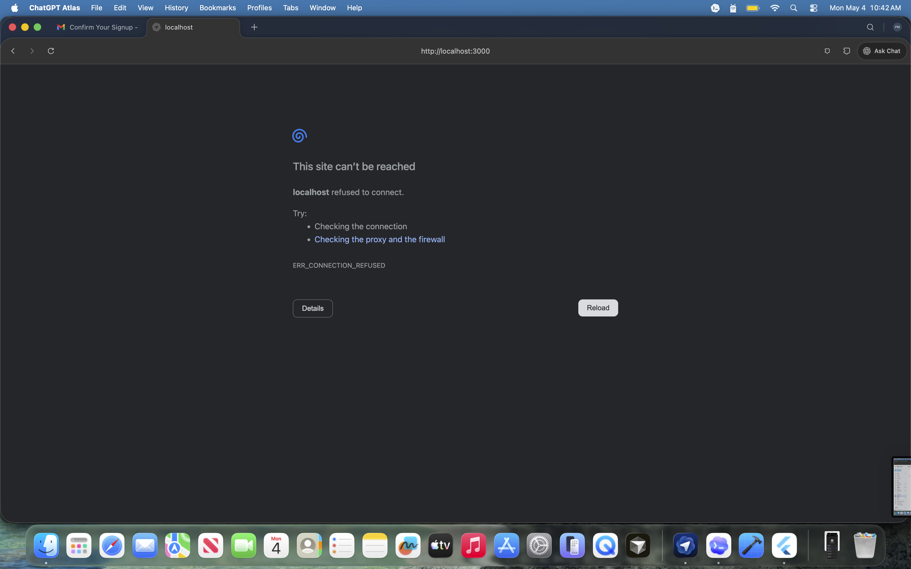
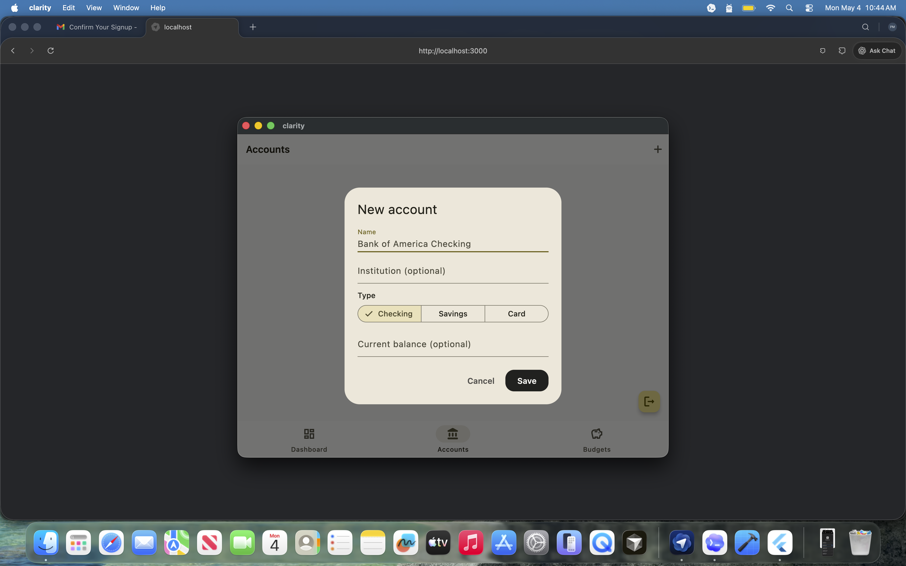
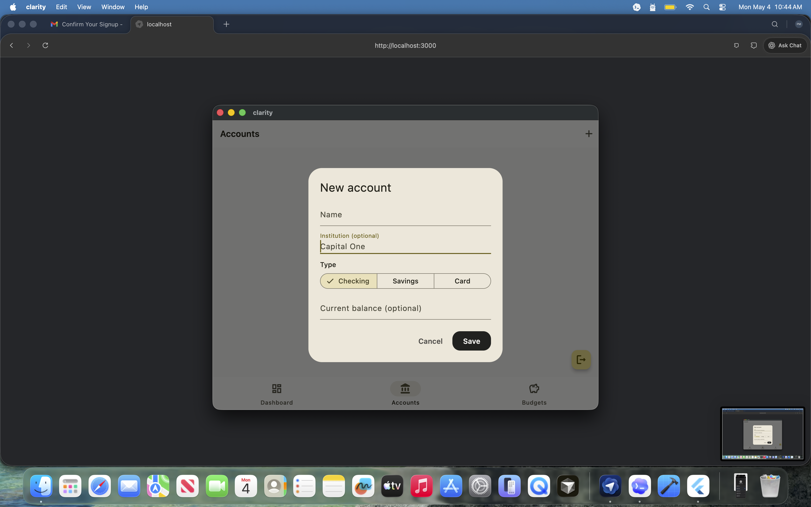
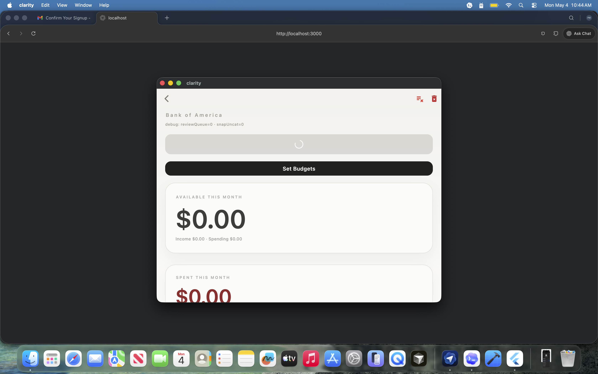
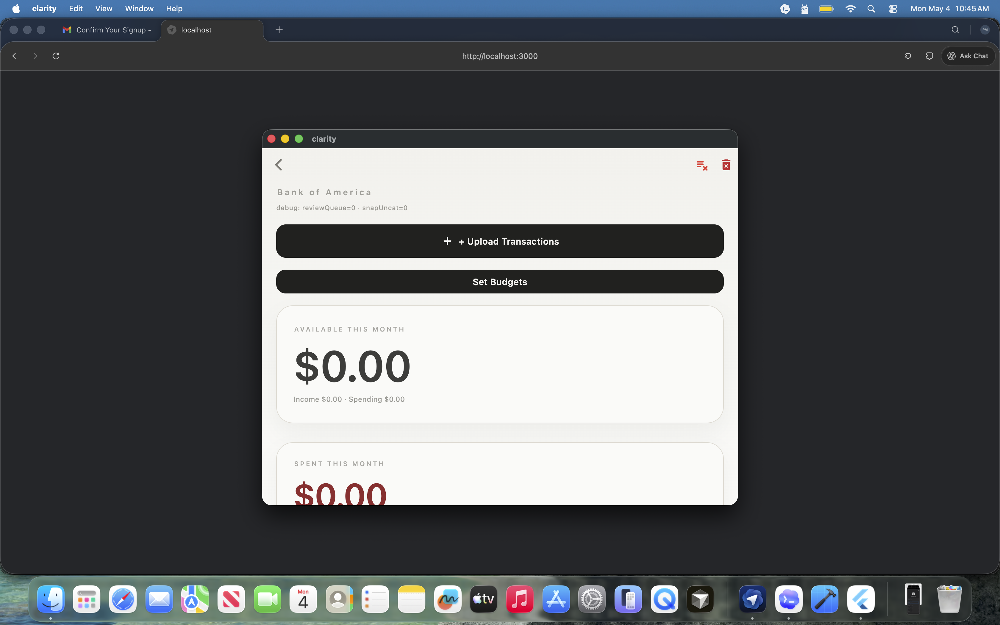
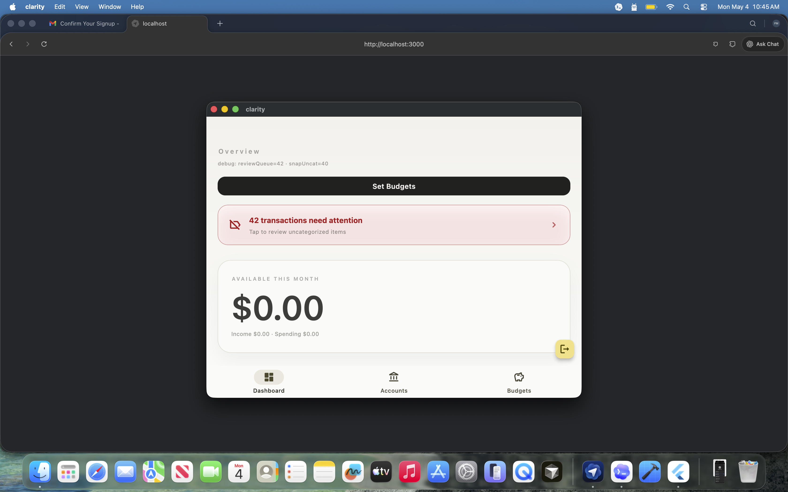
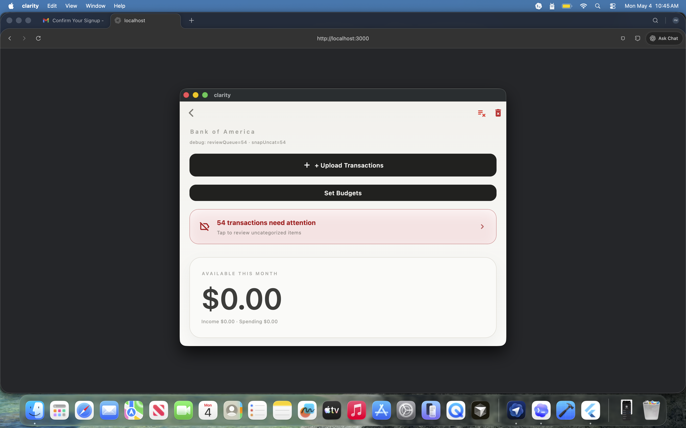
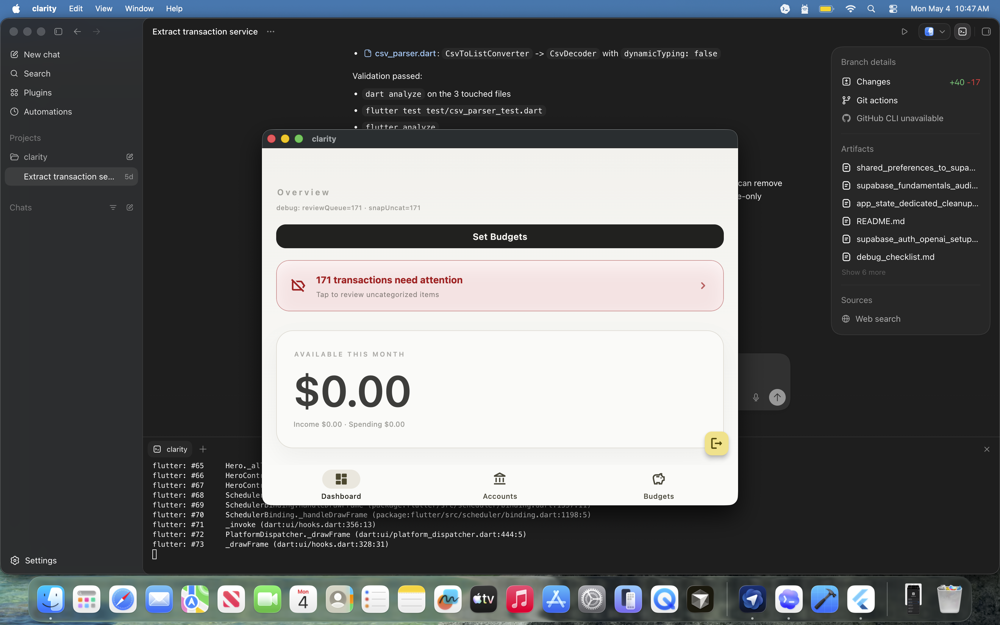

# Manual Test Report - Supabase Auth + CSV Import

Date: 2026-05-04  
Tester: Pedro Martins  
Build target: macOS desktop, Flutter debug build  
Scope: First manual test pass after Supabase Auth, Supabase data services, CSV import, and Edge Function migration.

Historical note: this report records bugs observed on May 4, 2026. Current CSV
import, automatic AI categorization, Budget category visibility, and merchant
learning requirements are defined in
[`csv_import_ai_categorization.md`](csv_import_ai_categorization.md).

## Summary

Automated checks passed before manual testing:

```sh
flutter analyze
# No issues found

flutter test
# All tests passed
```

Manual testing found several product and integration issues. The most important problems are:

- Auth confirmation flow is not branded or properly routed back into Clarity.
- Runtime logs show repeated Flutter Hero exceptions caused by duplicate default `FloatingActionButton` hero tags.
- CSV import does not show the expected clear loading/progress experience.
- AI categorization is not applying categories after upload, leaving imported transactions uncategorized.
- Budget category data does not match the expected fresh Supabase-driven flow.

## Evidence Screenshots

Screenshots were copied into:

```text
docs/manual_test_assets/2026-05-04/
```

## Issues

### 1. Auth Signup Confirmation Needs Dedicated App Page

Priority: High  
Area: Auth UX  
Status: Open

After creating an account, the app returns to the login/account creation page and shows a small inline message:

```text
Check your email to confirm your account.
```

This works technically, but the message is too easy to miss and does not feel like a complete confirmation state.

Expected behavior:

- After signup, show a dedicated "Check your email" page.
- Include the user's email address if available.
- Explain that the account is not active until email confirmation is completed.
- Provide actions such as "Back to sign in", "Resend email", and maybe "Open email app" where supported.

Evidence:



### 2. Supabase Confirmation Email Is Not Branded As Clarity

Priority: High  
Area: Auth email configuration  
Status: Open

The confirmation email currently appears as:

```text
From: Supabase Auth <noreply@mail.app.supabase.io>
Subject: Confirm Your Signup
Body:
Confirm your signup
Follow this link to confirm your user:
Confirm your mail
```

The customer has no clear indication that this email belongs to Clarity.

Expected behavior:

- Sender name should be Clarity.
- Subject should reference Clarity.
- Email copy should be branded and explain why the user is receiving it.
- The confirmation CTA should be Clarity-specific.
- Use Supabase Auth email templates and, ideally, a custom SMTP sender/domain.

Evidence:



### 3. Confirmation Link Redirects To Broken localhost:3000 Page

Priority: High  
Area: Auth redirect/deep link  
Status: Open

After clicking the confirmation email link, the browser opens:

```text
http://localhost:3000
```

The page does not load:

```text
localhost refused to connect
ERR_CONNECTION_REFUSED
```

Expected behavior:

- Confirmation should redirect to a valid Clarity confirmation page.
- For desktop app testing, configure a working local callback or Supabase redirect URL that the app can handle.
- For production, redirect to a hosted Clarity page or supported deep link.
- The confirmation success page should tell the user what happened and how to return to the app.

Evidence:



### 4. Account Creation Shows Old Bank Names / Suggestions

Priority: Medium  
Area: Account creation UX / data freshness  
Status: Needs investigation

During account creation, the account dialog suggested or showed old bank-related values such as:

```text
Bank of America Checking
Capital One
```

This is unexpected after the local app data cleanup.

Expected behavior:

- New account form should start blank.
- No previous local account names should appear from old app state.
- If this is OS-level text autofill, decide whether to disable autofill for these fields.
- If this comes from app defaults or Supabase test data, remove that behavior.

Evidence:





### 5. CSV Upload Does Not Show The Expected Loading Bar

Priority: Medium  
Area: CSV import UX  
Status: Open

After uploading a CSV, the UI does not show the loading bar/progress indicator expected from the previous design.

Observed:

- There is some temporary loading/spinner state.
- There is no clear import progress bar.
- The user cannot tell if the app is parsing, inserting rows, categorizing, or stuck.

Expected behavior:

- Show a clear CSV import progress UI.
- Distinguish parsing, inserting transactions, and AI categorization phases.
- For large CSVs, show progress by rows or batches if available.
- Disable repeat upload actions while import is running.

Evidence:





### 6. AI Categorization Did Not Categorize Imported Transactions

Priority: High  
Area: AI categorization / transaction import flow  
Status: Open

After CSV upload, transactions were not categorized by AI. The dashboard/account screens show attention banners such as:

```text
42 transactions need attention
54 transactions need attention
67 transactions need attention
78 transactions need attention
171 transactions need attention
```

This conflicts with the intended product direction:

- AI should categorize imported transactions automatically.
- The user should review/change categories manually afterward.
- Manual category corrections should later feed an AI learning flow.

Current behavior appears consistent with the recently simplified implementation where post-import AI auto-apply was disabled.

Expected behavior:

- CSV import should call the Supabase Edge Function AI categorization path after inserting transactions.
- AI category IDs should be written back to Supabase transactions.
- The review queue should contain only transactions the AI could not categorize or transactions below a confidence threshold, once confidence exists again.
- The old "everything needs attention" state should not be the default successful import result.

Evidence:








### 7. Budget Categories Do Not Match Fresh Supabase Flow

Priority: High  
Area: Budgets / categories  
Status: Open

The budgets UI looks visually good, but the category set appears to be based on the first CSV/local-account era data instead of a fresh Supabase-driven flow.

Expected behavior:

- On a fresh user/account before CSV upload, budgets should not show stale categories from prior local data.
- After CSV upload, AI should categorize transactions.
- Budget categories should be derived from the same categories assigned to transactions.
- Budget category list should reflect current authenticated user's Supabase data only.

Notes:

- Built-in static categories may still exist by design, but they should not look like stale user-imported categories.
- This area should be tested again after AI categorization writes category IDs to transactions.

### 8. Runtime Flutter Error: Duplicate FloatingActionButton Hero Tag

Priority: High  
Area: Navigation / Scaffold / FAB structure  
Status: Open

The terminal repeatedly logged:

```text
There are multiple heroes that share the same tag within a subtree.
Within each subtree for which heroes are to be animated (i.e. a PageRoute subtree), each Hero must have a unique non-null tag.
In this case, multiple heroes had the following tag: <default FloatingActionButton tag>
```

This means multiple `FloatingActionButton` widgets are active in the same route subtree with the default hero tag.

Expected behavior:

- Each visible FAB should have a unique `heroTag`.
- If a FAB does not need hero animation, set `heroTag: null`.
- Only one default-tag FAB should exist per route subtree.

Impact:

- This is a real runtime assertion in debug mode.
- It can break route transitions and indicates the current scaffold/FAB composition needs cleanup.

### 9. Debug Text Is Visible In The App UI

Priority: Medium  
Area: UI polish / debug cleanup  
Status: Open

Several screenshots show visible debug copy:

```text
debug: reviewQueue=0 - snapUncat=0
debug: reviewQueue=42 - snapUncat=40
debug: reviewQueue=171 - snapUncat=171
```

Expected behavior:

- Debug diagnostics should not be visible in normal app UI.
- If needed, keep them behind a debug flag or developer diagnostics overlay.

### 10. CSV Debug Logs Are Very Verbose

Priority: Low  
Area: Logging  
Status: Open

The CSV parser logs detailed diagnostics such as:

```text
[Clarity][CSV import] Column layout: HEADER_MATCH
[Clarity][CSV import] Date column: index=0 header="Date"
[Clarity][CSV import] Amount column: index=2 header="Amount"
[Clarity][CSV import] First row...
```

These are useful during parser debugging, but they are noisy during normal manual testing.

Expected behavior:

- Keep detailed CSV diagnostics available in debug tools.
- Avoid printing large diagnostic blocks on every import unless a debug flag is enabled.

## Terminal Log Notes

Relevant terminal context from this test:

```text
flutter analyze
No issues found

flutter test
All tests passed

flutter run
Launching lib/main.dart on macOS in debug mode...
Built build/macos/Build/Products/Debug/clarity.app
flutter: supabase.supabase_flutter: INFO: ***** Supabase init completed *****
```

Repeated runtime issue:

```text
flutter: [Clarity][FlutterError] There are multiple heroes that share the same tag within a subtree.
flutter: Within each subtree for which heroes are to be animated, each Hero must have a unique non-null tag.
flutter: In this case, multiple heroes had the following tag: <default FloatingActionButton tag>
```

CSV import diagnostics also appeared after upload and confirmed the parser detected columns and parsed rows.

## Recommended Fix Order

1. Fix duplicate `FloatingActionButton` hero tags.
2. Configure Supabase Auth branding and redirect URL.
3. Add dedicated post-signup "check your email" page.
4. Restore clear CSV import loading/progress state.
5. Reconnect post-import AI categorization so imported transactions get category IDs.
6. Make budgets derive categories from current user's Supabase categorized transactions.
7. Remove visible debug UI text.
8. Reduce CSV diagnostic logging noise behind a debug flag.
9. Investigate account form autofill/stale bank name behavior.

## Retest Checklist

- Create a fresh user.
- Verify branded confirmation email.
- Click confirmation link and confirm it lands on a working Clarity confirmation page.
- Sign in after confirmation.
- Create a blank account from scratch and verify no stale field values.
- Upload a CSV and verify progress/loading states.
- Confirm AI categorizes transactions after upload.
- Confirm review queue only contains true uncategorized/low-confidence items.
- Confirm budget categories match current user's Supabase transaction categories.
- Watch terminal for zero Flutter runtime assertions.
